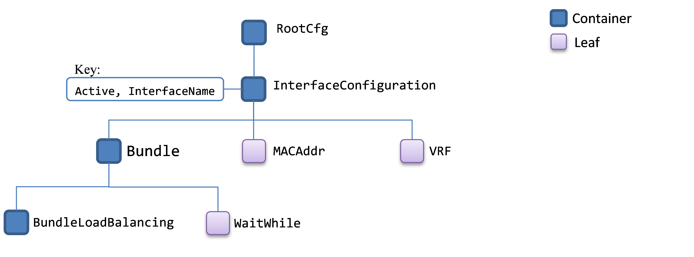
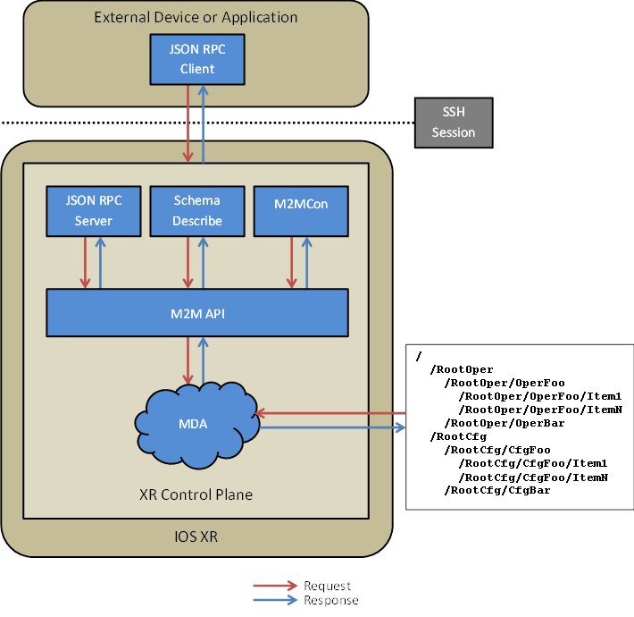

Machine-to-Machine API
======================

The Machine-to-Machine (M2M) API provides an experimental abstraction layer to expose the capabilities and services of the router to external clients, providing users with a simple means to automate management operations. The M2M API provides programmatic access to manageability data via the JSON-RPC protocol; a set of common JSON-RPC methods operate on all manageability data in the IOS-XR system.

Concepts
========

Management Data Schema
----------------------
The M2M API is based on a hierarchical model of the management data within IOS-XR. This model is described by a tree-like schema modelling the configuration and operational data for a router. The diagram below shows a small sub-section of the schema pertaining to interface configuration.

Note that the schema is split into two trees, one for configuration data (under `RootCfg`) and one for operational data (under `RootOper`).

An individual node in the hierarchy is called a class. Classes represent a type of data that can exist, rather than particular items of data that happen to exist at a given time. There are two categories of class:

  * `Container`: Has other classes as 'children'. Containers group together other classes but don't represent values. The InterfaceConfiguration class shown in the diagram above is an example of a container: it groups together all classes describing interface configuration.
  * `Leaf`: A leaf represents one or more values. For example, the `MACAddr` class above describes the MAC address of a particular interface.

Classes may have key parameters. Keys identify different instances of the class in data described by the schema. For example, the Interface class has two key parameters, one identifying whether the interface is active, and one giving the interface name.

Paths
-----
In order to identify data described by the schema, two pieces of information are needed:

  1. A sequence of classes identifying a point in the schema hierarchy.
  2. Values for any key parameters required by the classes in the sequence. 

This information is encoded in a path. Paths are used throughout the M2M API to identify particular data items. For example, the following path represents the MAC Address for the interface `HundredGigE0/0/0/0`:

    RootCfg.InterfaceConfiguration({"Active": "act", "InterfaceName": "HundredGigE0/0/0/0"}).MACAddr

Some or all key values for a particular class may be optional, in which case they may be omitted from the path, or be explicitly listed as `null`. Paths may also omit key values (at the end of the path) to refer to all instances of the class. For example `RootCfg.InterfaceConfiguration` is a path referring to the configuration for all interfaces.
 
The path is constructed using the following syntax:

  * The sequence of class names identifying a schema hierarchy point is separated by `.` characters.
  * For each class with key parameters, these are enclosed in the `(` and `)` characters, and specified either in:
    * JSON object format, mapping key-names to key-values.
    * JSON array format, containing just the key-values. Using this syntax, the path corresponding to the example above would be `RootCfg.InterfaceConfiguration(["act", "HundredGigE0/0/0/0"]).MACAddr`.

Note that if using array syntax for keys, the values must be listed in the order in which the keys appear in the schema. Any optional keys appearing in the middle of the key sequence for which a value is not required must be explicitly listed as `null`. 

Note also that the syntax of key parameters is valid JSON, allowing simple parsing and generation of paths.
 
Wildcards and limited pattern matching are supported in key-values to identify a set of schema hierarchy points matching certain criteria. Wildcards are represented by an un-quoted `*` character, and identify the set of schema hierarchy points with any value for the key in question. For example, the following represents the set of MAC address nodes for all interfaces:

    RootCfg.InterfaceConfiguration({"Active": "act", "InterfaceName": *}).MACAddr

The following pattern matching features are supported:

  * Globbing, using the `*` character. Note that MPG currently supports globbing for only the following MPG datatypes:
    * `STRING`
    * `TEXT`
    * `IDENTIFIER`
    * `ENCODED_STRING`
    * `BOUNDED_STRING`
    * `BOUNDED_IDENTIFIER`
    * `ENCODED_BOUNDED_STRING`
    * `STRING_LIST`
    * `INTERFACE_NAME`
    * `INTERFACE_FORWARD`
  * Disjunctions, using the `|` character.
  * Grouping, using the `(` and `)` characters.
 
The following examples show the usage of the supported regular expression features to identify the set of MAC address nodes for particular sets of interfaces:
 
    RootCfg.InterfaceConfiguration({"Active": "act", "InterfaceName": "tunnel-te*"}).MACAddr
    RootCfg.InterfaceConfiguration({"Active": "act", "InterfaceName": "(TenGigE|FortyGigE)"}).MACAddr

A single wildcard covering all key values is also supported, using the `*` character in the place of the usual key format. The following examples identifies the set of MAC address nodes for all keys for the `InterfaceConfiguration` class:

    RootCfg.InterfaceConfiguration(*).MACAddr

Values
------
Every leaf class in the schema has one of more value parameters. The representation of the value depends on the number of value parameters, either:

  * There is exactly one value parameter, in which case a singleton value is used. For example the value for a MAC address would simply be `"aa:bb:cc:dd:ee:ff"`.
  * There is more than one value parameter, in which case a compound value is used. There may be optional parameters, which may be omitted if they are not required. As with key parameters, two formats are supported:
    * A JSON object format, mapping each of the value names to its value. Optional values which are not required may be omitted or explicitly included as null.
    * A JSON array format, with just the values listed in the order they appear in the schema. Optional values which are not required must be explicitly included as null.

Individual value may be one of the following JSON types:

  * An integer.
  * A string. Many commonly-used data items such as network addresses are represented as strings.
  * A boolean value.
  * The null value.

The following example shows a leaf class representing an interface's configured IPv4 address, which has three value parameters: one giving the IP address, one giving the subnet mask, and one optional parameter giving a route tag. Valid values for such a class would be:

    {"Address": "203.0.113.1", "SubnetMask": "255.255.255.0", "RouteTag": 5}
    {"Address": "203.0.113.1", "SubnetMask": "255.255.255.0", "RouteTag": null}
    {"Address": "203.0.113.1", "SubnetMask": "255.255.255.0"}
    ["203.0.113.1", "255.255.255.0", 5]
    ["203.0.113.1", "255.255.255.0"]
    ["203.0.113.1", "255.255.255.0", null]

Using the M2M API
=================

The M2M API is a JSON-RPC-based API. A small set of methods are provided to perform common manageability operations across all manageability data. Access to the API is provided via a JSON-RPC server which runs on the router and is accessible through a SSH session. User-defined clients communicate with the JSON-RPC server in order to query manageability data and perform manageability operations. There may be multiple instances of the JSON-RPC server - each client communicates with only a single instance of the server and must open a separate SSH connection in which to run the server.

Launching the JSON-RPC Server
-----------------------------
The JSON-RPC server is launched using the `run` command, either from the IOS-XR console or from within an SSH session. It is recommended to start the JSON-RPC server 'inline' with the SSH session open, as follows:

    ssh <router IP address> run json_rpc_server

Once the server has been started, commands can be entered on the server's stdin, and responses will appear on the server's stdout. Note that by default, the server will not echo input on the terminal, the `-e` option can be passed to turn local echo on.

Note that IOS-XR supports at most 8 instances of the JSON-RPC server running concurrently. However, this requires 8 separate SSH connections. A user wishing to have that many simultaneous SSH sessions will have to increase the number of permitted sessions via the following configuration:

    (config)#vty-pool default 0 8

The following example illustrates starting the server and a simple request and response exchange:

    bash$ ssh 192.168.0.1 run json_rpc_server
    {"jsonrpc": "2.0", "id": 1, "method": "get", "params": {"path": "RootCfg.InterfaceConfiguration({\"Active\": \"act\", \"InterfaceName\": \"GigabitEthernet0/0/0/0\"}).MACAddr"}}
    {"jsonrpc": "2.0", "id": 1, "result": [[""RootCfg.InterfaceConfiguration({\"Active\": \"act\", \"InterfaceName\": \"GigabitEthernet0/0/0/0\"}).MACAddr", "aa:bb:cc:dd:ff"]]}

JSON-RPC Operations
-------------------
Requests to the M2M API are made using version 2.0 of the JSON-RPC protocol.

A request has the following members:

  * `jsonrpc` (mandatory): Specifies the version, must be `2.0`.
  * `id` (mandatory): An identifer established by the client which must contain a string, number or null value. The JSON-RPC server will include the same identifier in its response.
  * `method` (mandatory): A string containing the method name. See the API reference section for a complete list of supported methods.
  * `params` (optional): An object containing the parameters for the method in question. If no parameters are required it may be omitted.

The JSON-RPC server will respond to each request with exactly one response. A response has the following members:

  * `jsonrpc`: Specifies the version, will always be `2.0`.
  * `id`: This matches the value of the `id` member in the corresponding request.
  * `result`: If the request was successful, the result member will contain an object containing the results of the request - see the API reference for more details of the result format for each method. If the request was not successful, this field will be omitted. Note that a null value for this field indicates that the request was successful - this occurs in the case where the method in question has no associated result data.
  * `error`: If the request was not successful, the error member will contain an object describing the cause of the failure - see the API reference for more details on the possible values for the error field.

An example of a successful request and response is shown below:

Request (client to server):

    {
        "jsonrpc": "2.0",
        "id": 1,
        "method": "get",
        "params": { "path": "RootCfg.Hostname" }
    }

Response (server to client):

    {
        "jsonrpc": 2.0,
        "id": 1,
        "result": [["RootCfg.Hostname", "PE-C"]]
    }

The JSON-RPC server supports batching of requests, which can be useful for efficiently making a large number of requests. A batch of requests is grouped in an array. The server will respond to each batched request with exactly one response, containing an array of responses for the requests.

An example of a batched request for a successful set of operations is below:

Request (client to server):

    [
        {
            "jsonrpc": "2.0", "id": 1, "method": "set",
            "params": {
                "path": "RootCfg.InterfaceConfiguration([\"act\", \"GigabitEthernet0/0/0/0\"]).VRF",
                "value": "vrf-a"
            }
        },
        {
            "jsonrpc": "2.0", "id": 2, "method": "set",
            "params": {
                "path": "RootCfg.InterfaceConfiguration([\"act\", \"GigabitEthernet0/0/0/1\"]).VRF",
                "value": "vrf-b"
            }
        },
        {
            "jsonrpc": "2.0", "id": 3, "method": "commit"
        }
    ]

Response (server to client):

    [
        {"jsonrpc": "2.0", "id": 1, "result": null},
        {"jsonrpc": "2.0", "id": 2, "result": null},
        {"jsonrpc": "2.0", "id": 3, "result": "100000001"}
    ]

Discovering Paths
-----------------
An important step in the workflow for using the M2M API is identifying the paths relating to the management data that the client wishes to query or modify. There are a number of different ways to do this, described in the sections below:

  * Schema Describe
  * M2M Console
  * The `get_schema` method

### Schema Describe
The Schema Describe command is a used to determine the schema path (or paths) associated with a CLI command. The command is executed on the router's CLI. The command can be used to identify schemas for either show commands or configuration. Further information about paths discovered by Schema Describe can be found using either the `get_schema` method or the M2M Console, as described in the sections below.

[Note] `schema-describe` is a heuristic-based tool and may not work on all possible show or configuration commands. For those on which it does not return a result, use one of the alternative methods of schema path discovery.

    Router# schema-describe show int br
    Action: get
    Path:   RootOper.Interfaces.InterfaceBrief

    Router# schema-describe config router isis 100
    Action: set
    Path:   RootCfg.ISIS.Instance({'InstanceName': '100'}).Running
    Value:  True

### M2M Console
The M2M Console is an interactive tool for exploring the schema. This can be used to browse the schema and identify paths. Further information about the M2M Console is available below.

An example of using the M2M Console to identify the path for Interface Statistics information follows:

    Router# run m2mcon
    m2mcon> cd RootOper
    m2mcon: RootOper> ls
    <snip>
    TunnelTemplate            L3VPN                     IPV6ARM
    Correlator                ServiceRedundancy         InfraStatistics
    RsvpApi-TE                MPLS_PCE                  MPLS_PCE_STDBY
    EVPN                      IPV6NodeDiscovery         ANCP
    QOS                       MACAccounting             Bundles
    SpanningTreeProtocol      OC                        STS
    STM                       VC                        Keychain
    <snip>
    m2mcon: RootOper> cd InfraStatistics
    m2mcon: RootOper.InfraStatistics> ls
    Interface
    m2mcon: RootOper.InfraStatistics> cd Interface
    m2mcon: RootOper.InfraStatistics.Interface>

### Get Schema Method
The M2M API provides a `get_schema` method, which returns information about a particular schema class. This information includes the class' children, which means that multiple `get_schema` calls can be chained together to build a complete picture of the schema - for example in an interactive app for browsing the schema. More information about the `get_schema` method is available in the M2M API Reference section.

API Reference
=============

M2M API Methods
---------------
The following JSON-RPC methods are supported by the M2M API. They are described in more details in the sections below:

  * [`get_version`](#get-version)
  * [`get`](#get)
  * [`get_children`](#get-children)
  * [`get_parent`](#get-parent-api-version-11-onwards) [API version 1.1 onwards]
  * [`set`](#set)
  * [`delete`](#delete)
  * [`replace`](#replace)
  * [`commit`](#commit-and-commit-replace)
  * [`commit_replace`](#commit-and-commit-replace)
  * [`discard_changes`](#discard-changes)
  * [`get_changes`](#get-changes)
  * [`get_schema`](#get-schema)
  * [`cli_exec`](#cli-exec)
  * [`cli_get`](#cli-get)
  * [`cli_set`](#cli-set-api-version-11-onwards) [API version 1.1 onwards]
  * [`cli_describe`](#cli-describe-api-version-12-onwards) [API version 1.2 onwards]
  * [`write_file`](#write-file)
  * [`normalize_path`](#normalize-path-api-version-11-onwards) [API version 1.1 onwards]

### Get Version
The `get_version` method returns the current version of the M2M API. It supports no parameters. It returns an object with two fields:

  * `major`: The major API version.
  * `minor`: The minor API version.

The following table gives a summary of the different versions:

<table>
  <tr>
    <th>Version</th>
    <th>Description</th>
  </tr>
  <tr>
    <td>1.0</td>
    <td>Original version, supported in IOS-XR 6.0</td>
  </tr>
  <tr>
    <td>1.1</td>
    <td>Supported in IOS-XR 6.1, adds the following new features:
      <ul>
        <li>Added the <code>get_parent</code> method.</li>
        <li>Added the <code>normalize_path</code> method.</li>
        <li>Added the <code>cli_set</code> method.</li>
        <li>Support for nested output format in <code>get</code> and <code>cli_get</code> requests.</li>
        <li>Support for bulk <code>set</code>, <code>delete</code> and <code>replace</code> operations.</li>
      </ul>
    </td>
  </tr>
  <tr>
    <td>1.2</td>
    <td>Supported in IOS-XR 6.1, adds the following new features:
      <ul>
        <li>Support for the <code>bag_types</code> field in the output of <code>get_schema</code></li>
        <li><code>delete</code> now performs deletes optimally where possible (taking on the semantics of <code>replace</code>, which is maintained for backwards compatibility).</li>
        <li>Added the <code>cli_describe</code> method.</li>
      </ul>
    </td>
  </tr>
</table>

An example of the usage of this method is as follows:

Request (client to server):

    {
        "jsonrpc": "2.0",
        "id": 1,
        "method": "get_version"
    }

Response (server to client):

    {
        "jsonrpc": "2.0",
        "id": 1,
        "result": {
            "major": 1,
            "minor": 2
        }
    }

### Get
The `get` method is used to read manageability information. It supports the following parameters:

  * `path` (mandatory) - the path of the data to get.
  * `format`, (optional from version 1.1 onwards) - allows the user to select between output formats. The following options are supported:
    * `"pairs"`: This is the default option, the output is formatted as a list of key-value pairs.
    * `"nested"`: The output is formatted as a nested hierarchy of JSON objects, with each section of the path represented by another level within the hierarchy. Keys and data are represented as fields within the objects.

This method returns an array of paths and their corresponding data. For leaf classes, this array will only contain the value for the class which was requested; for container classes, the paths and values of all of the requested class' children are returned.

The following shows an example of a `get` request on a leaf class:

Request (client to server):

    {
        "jsonrpc": "2.0",
        "id": 1,
        "method": "get",
        "params": {
            "path": "RootCfg.InterfaceConfiguration({\"Active\":\"act\",\"InterfaceName\":\"GigabitEthernet0/0/0/0\"}).MACAddr"
        }
    }

Response (server to client):

    {
        "jsonrpc": "2.0",
        "id": 1,
        "result": [
            ["RootCfg.InterfaceConfiguration({\"Active\": \"act\", \"InterfaceName\": \"GigabitEthernet0/0/0/0\"}).MACAddr", "aa:aa:bb:bb:cc:cc"]
        ]
    }

The following shows an example of a `get` request on a container class:

Request (client to server):

    {
        "jsonrpc": "2.0",
        "id": 1,
        "method": "get",
        "params": {
            "path": "RootCfg.InterfaceConfiguration({\"Active\": \"act\",\"InterfaceName\":\"GigabitEthernet0/0/0/0\"})"
        }
    }

Response (server to client):

    {
        "jsonrpc": "2.0",
        "id": 1,
        "result":  [
            ["RootCfg.InterfaceConfiguration({\"Active\": \"act\", \"InterfaceName\": \"GigabitEthernet0/0/0/0\"}).MACAddr", "aa:aa:bb:bb:cc:cc"],
            ["RootCfg.InterfaceConfiguration({\"Active\": \"act\", \"InterfaceName\": \"GigabitEthernet0/0/0/0\"}).Shutdown", true]
        ]
    }

Examples of the usage of the nested format corresponding to the examples above are shown below. Firstly, nested output for a leaf class:

Request (client to server):

    {
        "jsonrpc": "2.0",
        "id": 1,
        "method": "get",
        "params": {
             "path": "RootCfg.Hostname",
             "format": "nested"
        }
    }

Response (server to client):

    {
        "jsonrpc": "2.0",
        "id": 1,
        "result": {
            "RootCfg": {
                "Hostname": "PE-C"
            }
        }
    }

An example of nested output for a table container class is shown below:

Request (client to server):

    {
        "jsonrpc": "2.0",
        "id": 1,
        "method": "get",
        "params": {
            "path": "RootOper.Interfaces.InterfaceBrief",
            "format": "nested"
        }
    }

Response (server to client):

    {
        "jsonrpc": "2.0",
        "id": 1,
        "result": {
            "RootOper": {
                "Interfaces": {
                    "InterfaceBrief": [{
                        "InterfaceName": "GigabitEthernet0/0/0/0",
                        "MTU": 1500,
                        "LineState": "IM_STATE_DOWN",
                        "Description": "Connection to PE-A"
                    }, {
                        "InterfaceName": "GigabitEthernet0/0/0/1",
                        "MTU": 1514,
                        "LineState": "IM_STATE_UP",
                        "Description": "Connection to PE-B"
                    }]
                }
            }
        }
    }

An example of nested output for a non-table container class is shown below:

Request (client to server):

    {
        "jsonrpc": "2.0",
        "id": 1,
        "method": "get",
        "params": {
            "path": "RootCfg.VRF('vrf-a')",
            "format": "nested"
        }
    }

Response (server to client):

    {
        "jsonrpc": "2.0",
        "id": 1,
        "result": {
           "RootCfg": {
                "VRF": [{
                    "Name": "vrf-a",
                    "Create": true,
                    "AF": [{
                        "Family": "IPv4",
                        "Transport": "Unicast",
                        "Create": true,
                        "MaximumPrefix": [1024, null]
                    }]
                }]
            }
        }
    }

### Get Children
The `get_children` method returns the "child" nodes of a given path in the schema. It is only supported on container classes, an error will be returned if `get_children` is called for a leaf class. It supports the following parameters:

  * `path` (mandatory) - the path to get the child nodes for.

The method returns an array of the paths for the child nodes.

The following shows an example of a `get_children` request:

Request (client to server):

    {
        "jsonrpc": "2.0",
        "id": 1,
        "method": "get_children",
        "params": {
            "path": "RootCfg.InterfaceConfiguration({\"Active\": \"act\",\"InterfaceName\":\"GigabitEthernet0/0/0/0\"}).L2Transport"
        }
    }

Response (server to client):

    {
        "jsonrpc": "2.0",
        "id": 1,
        "result": [
            "RootCfg.InterfaceConfiguration({\"Active\": \"act\", \"InterfaceName\": \"GigabitEthernet0/0/0/0\"}).L2Transport.Enabled",
            "RootCfg.InterfaceConfiguration({\"Active\": \"act\", \"InterfaceName\": \"GigabitEthernet0/0/0/0\"}).L2Transport.PropagateRemoteStatus",
            "RootCfg.InterfaceConfiguration({\"Active\": \"act\", \"InterfaceName\": \"GigabitEthernet0/0/0/0\"}).L2Transport.PAC",
            "RootCfg.InterfaceConfiguration({\"Active\": \"act\", \"InterfaceName\": \"GigabitEthernet0/0/0/0\"}).L2Transport.CAC",
            "RootCfg.InterfaceConfiguration({\"Active\": \"act\", \"InterfaceName\": \"GigabitEthernet0/0/0/0\"}).L2Transport.L2Protocol",
            "RootCfg.InterfaceConfiguration({\"Active\": \"act\", \"InterfaceName\": \"GigabitEthernet0/0/0/0\"}).L2Transport.L2EthernetFeatures"
        ]
    }

### Get Parent [API version 1.1 onwards]
The `get_parent` method returns the path representing the parent of a given path. It supports a single parameter:

  * `path` (mandatory) - the path of the schema node whose parent to retrieve.

On success, the response will contain the single path of the parent. An example exchange is shown below:

Request (client to server):

    {
        "jsonrpc": "2.0",
        "id": 1,
        "method": "get_parent",
        "params": {
            "path": "RootOper.Interfaces.InterfaceBrief"
        }
    }

Response (server to client):

    {
        "jsonrpc": "2.0",
        "id": 1,
        "result": "RootOper.Interfaces"
    }

An example exchange for a path which ends with keys is shown below:

Request (client to server):

    {
        "jsonrpc": "2.0",
        "id": 1,
        "method": "get_parent",
        "params": {
            "path": "RootCfg.VRF('vrf-a')"
        }
    }

Response (server to client):

    {
        "jsonrpc": "2.0.,
        "id": 1,
        "result": "RootCfg.VRF"
    }

### Set
The `set` method writes the value of a leaf. It is only supported on paths in the configuration schema.

It supports the following parameters:

  * `path` (mandatory) - the path of the item to set.
  * `value` (mandatory) - the value to set.

The method has no return value - the response will contain an empty (null) result.

The following shows an example of a `set` request:

Request (client to server):

    {
        "jsonrpc": "2.0",
        "id": 1,
        "method": "set",
        "params": {
            "path": "RootCfg.InterfaceConfiguration({\"Active\":\"act\",\"InterfaceName\":\"GigabitEthernet0/0/0/0\"}).VRF", "value": {"VRFName": "VRF-A"}
        }
    }

Response (server to client):

    {
        "jsonrpc": "2.0",
        "id": 1,
        "result": null
    }

From version 1.1 onwards, the set method also supports setting multiple items in a single call, by passing arrays for the `path` and `value` parameters. The `path` and `value` arrays must be of equal length; an `invalid_argument_error` is returned if the lengths of these arrays differ. An example exchange for a bulk set request is shown below:

Request (client to server):

    {
        "jsonrpc": "2.0",
        "id": 1,
        "method": "set",
        "params": {
            "path": [
                "RootCfg.InterfaceConfiguration(['act', 'GigabitEthernet0/0/0/0']).VRF",
                "RootCfg.InterfaceConfiguration(['act', 'GigabitEthernet0/0/0/1']).VRF"
            ],
            "value": [
                "vrf-a",
                "vrf-b"
            ]
        }
    }

Response (server to client):

    {
        "jsonrpc": "2.0",
        "id": 1,
        "result": null
    }

### Delete
The `delete` method deletes the contents of a path. It is only supported on paths in the configuration schema. From API version 1.2 onwards, this is an optimal delete, which takes the semantics of a replace operation. For earlier versions of the API, the `delete` method deletes everything under the subtree, table or leaf.

It supports the following parameters:

  * `path` (mandatory) - the path of the class to delete.

The method has no return value - the response will contain an empty (null) result.

The following shows an example of a `delete` request:

Request (client to server):

    {
        "jsonrpc": "2.0",
        "id": 1,
        "method": "delete",
        "params": {
            "path": "RootCfg.InterfaceConfiguration({\"Active\":\"act\",\"InterfaceName\":\"GigabitEthernet0/0/0/0\"}).Shutdown"
        }
    }

Response (server to client):

    {
        "jsonrpc": "2.0",
        "id": 1,
        "result": null
    }

From version 1.1 onwards, the `delete` method also supports deleting multiple items in a single call, by passing an array of paths for the `path` parameter. An example exchange for a bulk delete is shown below:

Request (client to server):

    {
        "jsonrpc": "2.0",
        "id": 1,
        "method": "delete",
        "params": {
            "path": [
                "RootCfg.InterfaceConfiguration(['act', 'GigabitEthernet0/0/0/0']).Shutdown",
                "RootCfg.InterfaceConfiguration(['act', 'GigabitEthernet0/0/0/1']).Shutdown"
            ]
        }
    }

Response (server to client):

    {
        "jsonrpc": "2.0",
        "id": 1,
        "result": null
    }

### Replace
The `replace` method marks a set of data in the particular part of the schema for atomic replacement during a bulk configuration operation. It supports the following parameters:

  * `path` (mandatory) - the root of the schema subtree to replace. All items under this path will be replaced with any data under the same path which is in the commit buffer the next time the commit method is called. 

The method has no return value - the response will contain an empty (null) result.

Note that from API version 1.2, this method is deprecated in favor of the `delete` method, which now has the semantics of the `replace` method. The `replace` method is retained for backwards compatibility.

The following shows an example of replacing the configuration for a particular interface with a different set of configuration, using the `replace`, `set` and `commit` methods. The `get` method is used to inspect the interface's configuration before and after the operation.

Get request (client to server):

    {
        "jsonrpc": "2.0",
        "id": 1,
        "method": "get",
        "params": {
            "path": "RootCfg.InterfaceConfiguration({\"Active\":\"act\",\"InterfaceName\":\"GigabitEthernet0/0/0/0\"})"
        }
    }

Get response (server to client):

    {
        "jsonrpc": "2.0",
        "id": 1,
        "result": [
            ["RootCfg.InterfaceConfiguration({\"Active\": \"act\", \"InterfaceName\": \"GigabitEthernet0/0/0/0\"}).VRF", "vrf-a"], ["RootCfg.InterfaceConfiguration({\"Active\": \"act\", \"InterfaceName\": \"GigabitEthernet0/0/0/0\"}).MACAddr", "aa:aa:bb:bb:cc:cc"],
            ["RootCfg.InterfaceConfiguration({\"Active\": \"act\", \"InterfaceName\": \"GigabitEthernet0/0/0/0\"}).Shutdown", true]
        ]
    }

Replace request (client to server):

    {
        "jsonrpc": "2.0",
        "id": 2,
        "method": "replace",
        "params": {
            "path": "RootCfg.InterfaceConfiguration({\"Active\":\"act\",\"InterfaceName\":\"GigabitEthernet0/0/0/0\"})"
        }
    }

Replace response (server to client):

    {
        "jsonrpc": "2.0",
        "id": 2,
        "result": null
    }

Set request (client to server):

    {
        "jsonrpc": "2.0",
        "id": 3,
        "method": "set",
        "params": {
            "path": "RootCfg.InterfaceConfiguration({\"Active\":\"act\",\"InterfaceName\":\"GigabitEthernet0/0/0/0\"}).VRF",
            "value": {"VRFName": "VRF-B"}
        }
    }

Set response (server to client):

    {
        "jsonrpc": "2.0",
        "id": 3,
        "result": null
    }

Commit request (client to server): 

    {
        "jsonrpc": "2.0",
        "id": 4,
        "method": "commit",
        "params": {
            "label": "replace"
        }
    }

Commit response (server to client):

    {
        "jsonrpc": "2.0",
        "id": 4,
        "result": "1000000001"
    }

Get request (server to client):

    {
        "jsonrpc": "2.0",
        "id": 5,
        "method": "get",
        "params": {
            "path": "RootCfg.InterfaceConfiguration({\"Active\":\"act\",\"InterfaceName\":\"GigabitEthernet0/0/0/0\"})"
        }
    }

Get response (client to server):

    {
        "jsonrpc": "2.0",
        "id": 1,
        "result": [
             ["RootCfg.InterfaceConfiguration({\"Active\": \"act\", \"InterfaceName\": \"GigabitEthernet0/0/0/0\"}).VRF", "vrf-b"]
        ]
    }

From version 1.1 onwards, the `replace` method also supports replacing multiple items in a single call, by passing an array of `paths` for the path parameter. An example exchange for a bulk replace is shown below:

Request (client to server):

    {
        "jsonrpc": "2.0",
        "id": 1,
        "method": "replace",
        "params": {
            "path": [
                "RootCfg.InterfaceConfiguration(['act', 'GigabitEthernet0/0/0/0'])",
                "RootCfg.InterfaceConfiguration(['act', 'GigabitEthernet0/0/0/1'])"
            ]
        }
    }

Response (server to client):

    {
        "jsonrpc": "2.0",
        "id": 1,
        "result": null
    }

### Commit and Commit Replace
The `commit` method commits a bulk of configuration. Upon calling this method, the contents of the commit buffer (any sets, deletes and replaces which have been made since the last commit call) will be committed to the running configuration. It supports the following parameters:

  * `label` (optional) - A string to be used as a label for the commit.
  * `comment` (optional) - A string providing a comment to be associated with the commit.

The method returns a string containing the identifier.

The `commit replace` method is similar to the `commit` method - it takes the same parameters and has the same return value - but replaces the entirety of the running configuration with the contents of the commit buffer.

The following example shows the usage of the `commit_replace` method - the `commit` method has the same usage:

Request (client to server): 

    {
        "jsonrpc": "2.0",
        "id": 1,
        "method": "commit_replace",
        "params": {
            "label": "initial",
            "comment": "Initial set of configuration"
        }
    }

Response (server to client):

    {
        "jsonrpc": "2.0",
        "id": 1,
        "result": "1000000001"
    }

### Get Changes
The `get_changes` method lists the contents of the commit buffer. It supports no parameters

The method returns an array of objects containing the following fields:

  * `path` - The path on which the configuration operation was requested.
  * `operation` -  The operation which was requested: `"SET"`, `"DELETE"` or `"REPLACE"`.
  * `value` - For set operations, the value which was set. For delete and replace operations, this will be null.

The following shows an example of the usage of `get_changes` after using the set method to change VRF and shutdown configuration on an interface, but before calling the commit method:

Request (client to server):

    {
        "jsonrpc": "2.0",
        "id": 1,
        "method": "get_changes"
    }

Response (server to client)

    {
        "jsonrpc": "2.0",
        "id": 1,
        "result": [
            {
                "path": "RootCfg.InterfaceConfiguration({\"Active\": \"act\", \"InterfaceName\": \"GigabitEthernet0/0/0/0\"}).VRF",
                "operation": "SET",
                "value": "vrf-a"
            },
            {
                "path": "RootCfg.InterfaceConfiguration({\"Active\": \"act\", \"InterfaceName\": \"GigabitEthernet0/0/0/0\"}).Shutdown",
                "operation": "SET",
                "value": true
            }
        ]
    }

### Discard Changes
The `discard_changes` method discards the contents of the commit buffer. It supports no parameters. The method has no return value - the response will contain an empty (null) result.

### Get Schema
The `get_schema` method returns information about a given schema class. It supports the following parameters:

  * `path` (mandatory) - The path identifying the schema class to get information for.
  * `fields` (optional) - An array of field names. This may be used to restrict the information returned in the result: only the fields listed in this array will be returned. If this parameter is not included, all fields will be returned.

The method returns an object describing the requested schema class, containing the following fields:

  * `category`: the category of the schema class: `container` or `leaf`.
  * `children`: an array of paths for the child classes for the requested class, or an empty array if there are no children.
  * `description`: A string describing the class.
  * `hidden`: A boolean value indicating whether the class is hidden.
  * `key`: For classes for which there is an associated key value, an object information about the key, the contents of which are described below. If the requested class has no associated key, this field will be null. 
  * `presence`: A schema path identifying the leaf class that gives this class presence, or null if there is no such leaf class.
  * `value`:  An object describing the format and meaning of the data contained in the class. If the class has no associated value (i.e. is a container) then this field will be omitted.
  * `version`: an object containing the major and minor version numbers for the given class, the contents of which are described below. If the class has no versioning information, then this field is omitted.
  * `version_comapatibility`: a tuple describing the minimum and maximum (in the first and second elements of the tuple respectively) versions with which the Schema class represented by a given path is compatible. If the class has no version compatibility information, then this field is omitted.
  * `table_description`: If the class is part of a table, then this field contains a description of the table. If the class is not part of a table, then it is omitted.
  * `table_version`: If the class is part of a table, then this field contains the major and minor version numbers for the table. If the class is not part of a table, or if the table has no associated version information, then it is omitted.
  * `table_version_compatibility`: If the class is part of a table, then this field contains the version compatibility information for the table. If the class is not part of a table, or if the table has no associated version compatibility information, then it is omitted.

For the `bag_types` field, the objects associated with each bag type have the following fields:

  * `name`: A string giving the name of the bag structure, union or enum
  * `description`: A string giving a description of the data in this structure, union or enum.
  * `datatype`: String describing the type of bag object this is one of `struct`, `union` or `enum`.
  * `children`: A list of elements in this bag object. Each element of the bag object is described by a JSON object, the fields of which are described below.
  * `datatype_args`: For union types, additional information about the discriminator of the union. This has the same fields as an entry in the `children` field. The fields of this object are discussed below.

The `children` and `datatype_args` fields contain objects with the following fields:

  * `name`: The name of the element in the bag structure, union or enum.
  * `description`: String describing the element in the structure, union or enum.
  * `datatype`: The type of the element. This can be one of `struct`, `union` or `enum`, or alternatively one of the primitive bag types. This field is omitted for elements of an enum.
  * `datatype_name`: String giving the name of the structure, union or enum if this parameter is an instance of one of these; null otherwise. This field is omitted for elements of an enum.
  * `status`: String describing the status of the element - whether it is mandatory, optional or a list of values. This is omitted for elements of an enum.
  * `status_args`: For elements with list status, this field contains a list of objects, with n objects returned for a list with n levels. Each object has two fields:
    * `fixed_length`: indicates whether or not the list is of fixed length.
    * `max_length`: describes the maximum length of the list. If the list is arbitrarily long, then a null maximum length is reported. This is omitted for elements of non-list status.

For the `key` and `value` fields, the returned object contains the following fields:

  * `datatype`: a string describing the type of data. The possible values for this field are given in the MPG documentation.
  * `internal_name`: if this is a bag, then it is the bag name, otherwise it is null.  The bag name will match the name field below, unless the schema specifies a Bag Display Name.
  * `name`: a string identifying the data.
  * `internal_name`: a string used internally to identify the data.
  * `description`: a verbose description of the data. Note that this may not be set, in which case the field will be set to null.
  * `datatype_args`: If the datatype is a parameterized type, an array of objects describing the parameter values for this instance of the type. For un-parameterized types, this will be null. The type each element in this field depends on the datatype field, it may be one of the following:
    * For integer range types, an object with `min` and `max` fields describing the valid range.
    * For bounded-length string types, an object with `minlen` and `maxlen` fields describing the valid string lengths.
    * For enumeration types, an `enumeration` object, as described below.
    * For range enumeration types, a `range-enumeration` object, as described below.
    * For string list types, a string list object, as described below.
  * `repeat_count`: The number of times the parameter is repeated in data described by the schema. This will be 1 unless the parameter is an array.
  * `status`: A string describing the requirements on values described by this parameter. It may be one of the following:
    * `mandatory`: The value must be specified for this parameter.
    * `optional`: The value may be specified for this parameter.
    * `ignored`: The value may be specified for this parameter, but any value given will have no effect on the system.

The below sub-sections describe the different types which may be returned in the `datatype_args` field.

#### Enumeration
An enumeration is represented by a JSON object where each field corresponds to an enumeration label, and maps to the value and description of that label. This is best illustrated by example:

    {
        "Default": {
            "value": 0,
            "description": "Default interface mode"
        },
        "PointToPoint": {
            "value": 1,
            "description": "Point-to-point interface mode"
        },
        "Multipoint": {
            "value": 2,
            "description": "Multipoint interface mode"
        },
        "L2Transport": {
            "value": 3,
            "description": "L2 transport interface mode"
        }
    }

#### Range Enumeration
A range enumeration is a hybrid between an integer range and an enumeration, where enumeration labels are provided for certain values in the range. The range is defined by `min` and `max` fields, with an enum field providing the enumeration labels, as shown in the example below:

    {
        "min": 0,
        "max": 4294967295,
        "enum": {
            "Blocked": {
                "value": 0,
                "description": "Blocked mesh group. Changed LSPs are not flooded over blocked interfaces",
            }
        }
    }

#### String List
A string list is a hash of strings to meta-data related to the strings, as shown below:

    {
        "act": {
            "description": "Interface is active"
        },
        "pre": {
            "description": "Interface is preconfigured"
        },
    }

#### Examples
The following example shows the usage of `get_schema` on a container class:

Request (client to server):

    {
        "jsonrpc": "2.0",
        "id": 1,
        "method": "get_schema",
        "params": {
            "path": "RootOper.Interfaces"
        }
    }

Response (server to client):

    {
        "jsonrpc": "2.0",
        "id": 1,
        "result": {
            "category": "CONTAINER",
            "version_compatibility": [null, null],
            "description": "Interface operational data",
            "presence": null,
            "table_description": null,
            "value": [],
            "version": {"major": 1, "minor": 3},
            "table_version": null,
            "key": [],
            "hidden": false,
            "children": [
                "RootOper.Interfaces.InterfaceBrief",
                "RootOper.Interfaces.Interface",
                "RootOper.Interfaces.InterfaceDescriptionTable",
                "RootOper.Interfaces.NodeTypeSet",
                "RootOper.Interfaces.InterfaceSummary",
                "RootOper.Interfaces.InventorySummary"
            ],
            "table_version_compatibility": null
        }
    }

The following example shows the usage of `get_schema` on a leaf class:

Request (client to server):

    {
        "jsonrpc": "2.0",
        "id": 1,
        "method": "get_schema",
        "params": {
            "path": "RootOper.Interfaces.InterfaceBrief"
        }
    }

Response (server to client):

    {
        "jsonrpc": "2.0",
        "id": 1,
        "result": {
            "category": "LEAF",
            "version_compatibility": [null, null],
            "description": "Brief operational attributes for a particular interface",
            "presence": null,
            "table_description": "Brief operational data for interfaces",
            "value": [{
                "status": "MANDATORY",
                "datatype_args": null,
                "name": "imds_ifattr_base_info",
                "internal_name": "imds_ifattr_base_info",
                "datatype": "BAG",
                "repeat_count": 1,
                "description": "Brief operational attributes for a particular interface"
            }],
            "version": null,
            "table_version": null,
            "key": [{
                "status": "MANDATORY",
                "datatype_args": null,
                "name": "InterfaceName",
                "internal_name": null,
                "datatype": "INTERFACE_NAME",
                "repeat_count": 1,
                "description": "The name of the interface"
            }],
            "hidden": false,
            "children": [],
            "table_version_compatibility": [null, null]
        }
    }

The following example shows a `get_schema` request on a schema leaf with a bag value, demonstrating the `bag_types` field available in API version 1.2:

Request (client to server):

    {
        "jsonrpc": "2.0",
        "id": 1,
        "method": "get_schema",
        "params": {
            "path": "RootOper.Interfaces.Summary",
            "fields": ["value", "bag_types"]
        }
    }

Response (server to client):

    {
        "jsonrpc": "2.0",
        "id": 1,
        "result": {
            "value": [{
                "datatype": "BAG",
                "internal_name": "im_if_summary_info",
                "name": "im_if_summary_info",
                "description": "Interface summary information",
                "datatype_args": null,
                "repeat_count": 1,
                "status": "MANDATORY"
            }],
            "bag_types": {
                "im_if_summary_info": {
                    "name": "im_if_summary_info",
                    "description": "Interface summary bag",
                    "datatype": "STRUCT",
                    "datatype_name": "im_if_summary_info",
                    "children": [{
                        "name": "InterfaceTypeList,
                        "description": "List of per interface type summary information",
                        "datatype": "STRUCT"
                        "datatype_name": "im_if_type_summary_td",
                        "status": "LIST",
                        "args": {"fixed_length": false, "max_length": null}
                    }, {
                        "name": "InterfaceCounts",
                        "description": "Counts for all interfaces",
                        "datatype": "STRUCT",
                        "datatype_name": "im_if_group_counts_td",
                        "status": "MANDATORY",
                    }],
                },
                "im_if_type_summary_td": {
                    "name": "im_if_type_summary_td",
                    "description": "Interface type summary information",
                    "datatype": "STRUCT",
                    "datatype_name": "im_if_summary_td",
                    "children": [{
                        "name": "InterfaceTypeName",
                        "description": "Name of the interface type",
                        "datatype": "STRING",
                        "datatype_name": null,
                        "status": "MANDATORY",
                    }, {
                        "name": "InterfaceTypeDescription",
                        "description": "Description of the interface type",
                        "datatype": "STRING"
                        "datatype_name": null,
                        "status": "MANDATORY",
                    }, {
                        "name": "InterfaceCounts",
                        "description": "Counts for interfaces of this type",
                        "datatype": "STRUCT",
                        "datatype_name": "im_if_group_counts_td",
                        "status": "MANDATORY",
                    }]
                },
                "im_if_group_counts_td": {
                    "name": "im_if_group_counts_td",
                    "description": "Interface counts",
                    "datatype": "STRUCT",
                    "datatype_name": "im_if_group_counts_td",
                    "children": [{
                        "name": "InterfaceCount",
                        "description": "Number of interfaces",
                        "datatype": "UINT32",
                        "datatype_name": null,
                        "status": "MANDATORY",
                    }, {
                        "name": "UpInterfaceCount",
                        "description": "Number of interfaces in UP state",
                        "datatype": "UINT32",
                        "datatype_name": null,
                        "status": "MANDATORY",
                    }, {
                        "name": "DownInterfaceCount",
                        "description": "Number of interfaces in DOWN state",
                        "datatype": "UINT32",
                        "datatype_name": null,
                        "status": "MANDATORY",
                    }, {
                        "name": "AdminDownInterfaceCount",
                        "description": "Number of interfaces in an ADMINDOWN state",
                        "datatype": "UINT32",
                        "datatype_name": null,
                        "status": "MANDATORY",
                    }]
                }
            }
        }
    }

### CLI Exec
The `cli_exec` method executes a given show command CLI, and returns the "raw" output from that show command (i.e. the output which would be seen when executing the show command from the console). It supports the following parameters:

  * `command` (mandatory) - The command to be executed. Note that unique abbreviations are accepted, in the same way that they are accepted in the IOS-XR CLI - for example `"sh int br"` can be passed instead of `"show interfaces brief"`.

The method returns a string containing the output of the show command (including control characters such as newline characters).

Request (client to server):

    {
        "jsonrpc": "2.0",
        "id": 1,
        "method": "cli_exec",
        "params": {
            "command" :"show int br"
        }
    }

Response (server to client):

    {
       "jsonrpc": "2.0",
       "id": 1,
       "result": "\n               Intf       Intf        LineP              Encap  MTU        BW\n               Name       State       State               Type (byte)    (Kbps)\n--------------------------------------------------------------------------------\n                Nu0          up          up               Null  1500          0\n          Gi0/0/0/0          up          up               ARPA  1514    1000000\n          Gi0/0/0/1  admin-down  admin-down               ARPA  1514    1000000\n          Gi0/0/0/2  admin-down  admin-down               ARPA  1514    1000000\n          Gi0/0/0/3  admin-down  admin-down               ARPA  1514    1000000\n          Gi0/0/0/4  admin-down  admin-down               ARPA  1514    1000000\n\n"
    }

### CLI Get
The `cli_get` method attempts to identify the schema classes containing the data associated with a given show command CLI, and returns the data for those classes - it is equivalent to using `schema-describe` on a show command and then performing a `get` request for the returned schemas. It supports the following parameters:

  * `command` (mandatory) - The command to be executed. Note that unique abbreviations are accepted, in the same way that they are accepted in the IOS-XR CLI - for example `"sh int br"` can be passed instead of `"show interfaces brief"`.
  * `format` (optional from version 6.1 onwards) - Indicates which format the results should be returned in (pairs or nested). The usage of this parameter is the same as for the `get` method.

The method returns an array of objects for the data associated with the given show command. The format of these objects is the same as returned by the get method.

Note: The `cli_get` method uses the same heuristic methods as the `schema-describe` tool to generate data, and so may not work for all commands.

Request (client to server):

    {
        "jsonrpc": "2.0",
        "id": 1,
        "method": "cli_get",
        "params": {"command" :"show int br"}
    }

Response (server to client):

    {
        "jsonrpc": "2.0",
        "id": 1,
        "result": [
            [
                "RootOper.Interfaces.InterfaceBrief({\"InterfaceName\": \"GigabitEthernet0/0/0/0\"})",
                {
                    "ActualLineState": "IM_STATE_UP",
                    "Type": "IFT_GETHERNET",
                    "ActualState": "IM_STATE_UP",
                    "MTU": 1514,
                    "EncapsulationTypeString": "ARPA",
                    "Bandwidth": 1000000,
                    "State": "IM_STATE_UP",
                    "ParentInterface": null,
                    "L2Transport": false,
                    "Interface": "GigabitEthernet0/0/0/0",
                    "Encapsulation": "ether",
                    "LineState": "IM_STATE_UP",
                    "SubInterfaceMTUOverhead": 0
                }
            ],
            [
                "RootOper.Interfaces.InterfaceBrief({\"InterfaceName\": \"GigabitEthernet0/0/0/1\"})",
                {
                    "ActualLineState": "IM_STATE_ADMINDOWN",
                    "Type": "IFT_GETHERNET",
                    "ActualState": "IM_STATE_ADMINDOWN",
                    "MTU": 1514,
                    "EncapsulationTypeString": "ARPA",
                    "Bandwidth": 1000000,
                    "State": "IM_STATE_ADMINDOWN",
                    "ParentInterface": null,
                    "L2Transport": false,
                    "Interface": "GigabitEthernet0/0/0/1",
                    "Encapsulation": "ether",
                    "LineState": "IM_STATE_ADMINDOWN",
                    "SubInterfaceMTUOverhead": 0
                }
            ],
            [
                "RootOper.Interfaces.InterfaceBrief({\"InterfaceName\": \"GigabitEthernet0/0/0/2\"})",
                {
                    "ActualLineState": "IM_STATE_ADMINDOWN",
                    "Type": "IFT_GETHERNET",
                    "ActualState": "IM_STATE_ADMINDOWN",
                    "MTU": 1514,
                    "EncapsulationTypeString": "ARPA",
                    "Bandwidth": 1000000,
                    "State": "IM_STATE_ADMINDOWN",
                    "ParentInterface": null,
                    "L2Transport": false,
                    "Interface": "GigabitEthernet0/0/0/2",
                    "Encapsulation": "ether",
                    "LineState": "IM_STATE_ADMINDOWN",
                    "SubInterfaceMTUOverhead": 0
                }
            ],
            [
                "RootOper.Interfaces.InterfaceBrief({\"InterfaceName\": \"GigabitEthernet0/0/0/3\"})",
                {
                    "ActualLineState": "IM_STATE_ADMINDOWN",
                    "Type": "IFT_GETHERNET",
                    "ActualState": "IM_STATE_ADMINDOWN",
                    "MTU": 1514,
                    "EncapsulationTypeString": "ARPA",
                    "Bandwidth": 1000000,
                    "State": "IM_STATE_ADMINDOWN",
                    "ParentInterface": null,
                    "L2Transport": false,
                    "Interface": "GigabitEthernet0/0/0/3",
                    "Encapsulation": "ether",
                    "LineState": "IM_STATE_ADMINDOWN",
                    "SubInterfaceMTUOverhead": 0
                }
            ],
            [
                "RootOper.Interfaces.InterfaceBrief({\"InterfaceName\": \"GigabitEthernet0/0/0/4\"})",
                {
                    "ActualLineState": "IM_STATE_ADMINDOWN",
                    "Type": "IFT_GETHERNET",
                    "ActualState": "IM_STATE_ADMINDOWN",
                    "MTU": 1514,
                    "EncapsulationTypeString": "ARPA",
                    "Bandwidth": 1000000,
                    "State": "IM_STATE_ADMINDOWN",
                    "ParentInterface": null,
                    "L2Transport": false,
                    "Interface": "GigabitEthernet0/0/0/4",
                    "Encapsulation": "ether",
                    "LineState": "IM_STATE_ADMINDOWN",
                    "SubInterfaceMTUOverhead": 0
                }
            ],
            [
                "RootOper.Interfaces.InterfaceBrief({\"InterfaceName\": \"Null0\"})",
                {
                    "ActualLineState": "IM_STATE_UP",
                    "Type": "IFT_NULL",
                    "ActualState": "IM_STATE_UP",
                    "MTU": 1500,
                    "EncapsulationTypeString": "Null",
                    "Bandwidth": 0,
                    "State": "IM_STATE_UP",
                    "ParentInterface": null,
                    "L2Transport": false,
                    "Interface": "Null0",
                    "Encapsulation": "null",
                    "LineState": "IM_STATE_UP",
                    "SubInterfaceMTUOverhead": 0
                }
            ]
        ]
    }

### CLI Set [API version 1.1 onwards]
The `cli_set` method sets or deletes the schema class associated with a given CLI command - it is equivalent to using `schema-describe` on a configuration command and then performing the corresponding set request. As with set requests, a `cli_set` request must be followed by a commit request in order to the commit the configuration change to the running configuration. It supports the following parameters:

  * `command` (mandatory) - The configuration command to be executed - note that only a single line of configuration can be entered, this includes commands which may be entered via a submode in the IOS-XR CLI. Note that unique abbreviations are accepted, in the same way that they are accepted in the IOS-XR CLI - for example `"int Gig0/0/0/0 shut"` can be passed instead of `"interface GigabitEthernet0/0/0/0 shutdown"`.

The method has no return value - the response will contain an empty (null) result.

The cli_set method can be used to delete configuration in the same way as when using the CLI: by prefixing `no` to the configuration string.

Note that the `cli_set` method requires the user to be in the `cisco_support` user group to execute.

Request (client to server):

    {
        "jsonrpc": "2.0",
        "id": 1,
        "method": "cli_set", 
        "params": {
            "command": "interface GigabitEthernet0/0/0/0 shutdown"
        }
    }

Response (server to client):

    {
        "jsonrpc": "2.0",
        "id": 1,
        "result": null
    }

Request (client to server):

    {
        "jsonrpc": "2.0",
        "id": 1,
        "method": "cli_set", 
        "params": {
            "command": "no interface GigabitEthernet0/0/0/0 shutdown"
        }
    }

Response (server to client):

    {
        "jsonrpc": "2.0",
        "id": 1,
        "result": null
    }

### CLI Describe [API version 1.2 onwards]
The `cli_describe` method returns the schema paths and JSON-RPC methods required to perform the same operation as an input CLI command. This method takes the following parameters:

  * `command` (mandatory) - the CLI command to map to its schema information.
  * `configuration` (mandatory) - a Boolean flag that should be set to true if the command is a configuration command.

On success, this method returns an array of objects with the following fields:

  * `path`: a schema path that can be used to perform the required CLI command.
  * `method`: the JSON-RPC method that should be used on this path
  * `value`: for schema paths that should be set, this field gives the value to  set it to. This is omitted for commands that do not set any values.

An example exchange for a successful request on a show command is shown below:

CLI describe Request (client to server)

    {
        "jsonrpc": "2.0",
        "id": "1",
        "method": "cli_describe",
        "params": {
            "command": "show interfaces brief",
            "configuration": false,
        }
    }

Response (server to client)

    {
        "jsonrpc": "2.0",
        "id": "1",
        "result": [{
            "path": "RootOper.Interfaces.InterfaceBrief",
            "method": "get",
        }]
    }

An example exchange for a successful request on a configuration command is shown below:

CLI describe Request (client to server):

    {
        "jsonrpc": "2.0",
        "id": "1",
        "method": "cli_describe",
        "params": {
            "command": "interface gigabitEthernet 0/0/0/0 shut",
            "configuration": true,
        }
    }

Response (server to client):

    {
        "jsonrpc": "2.0",
        "id": "1",
        "result": [{
            "path": "RootCfg. InterfaceConfiguration({'Active': 'act', 'InterfaceName': 'GigabitEthernet0/0/0/0'}).Shutdown",
            "method": "set",
            "value": true,
        }]
    }

### Write File
The `write_file` method allows writing a text file to a location on the router's disk. If the file does not exist, it is created, it is created; if the file already exists, it is overwritten. It supports the following parameters:

  * `filename` (mandatory) - A string containing the full path of the file to write.
  * `data` (mandatory) - A string containing the data to be written into the file.

The method has no return value - the response will contain an empty (null) result.

### Normalize Path [API version 1.1 onwards]
The `normalize_path` method validates that a given path is a valid path, and returns the path re-formatted to match the "standard" output format (for example using object notation for keys, rather than array notation). The method takes a single parameter:

  * `path` (mandatory) - the path to normalize.

If the path is valid, the normalized path is returned, otherwise an error indicating in which way the path is invalid is returned. An example exchange of a successful request is shown below:

Write file Request (client to server):

    {
        "jsonrpc": "2.0",
        "id": "1",
        "method": "normalize_path",
        "params": {
            "path": "RootOper.Interfaces.InterfaceBrief(['GigabitEthernet0/0/0/0'])"
        }
    }

Response (server to client):

    {
        "jsonrpc": "2.0",
        "id": "1",
        "result": "RootOper.Interfaces.InterfaceBrief({\"InterfaceName\": \"GigabitEthernet0/0/0/0\"})"
    }

Errors
------
Any errors encountered in the processing of a JSON-RPC method will be returned to the client in the standard JSON-RPC format: a JSON object with the following fields:

  * `code`: Integral error type, as described in the JSON-RPC standard. This will be one of the following values, depending on the type of error which was encountered.
    * `-32700`: A JSON-RPC request could not be parsed. The data field is not used for this error code.
    * `-32601`: A JSON-RPC request was made for a method that does not exist. The data field is not used for this error code.
    * `-32602`: The parameters to a JSON-RPC request were invalid. The data field is not used for this error code.
    * `-32000`: An error was detected while processing an otherwise valid JSON-RPC request. This is used to indicate errors from the XR software, such as configuration verify errors, or a request on a non-existent path. The data field describes the error in more detail.
  * `message`: A textual description of the error.
  * `data`: An array of data describing each error which was encountered. Each array element is an object containing the following fields:
    * type: A string identifying the type of error. May be one of the following values:
      * `config_commit_error`: A config commit transaction failed. The path, operation, value, category and error fields are used to describe the configuration error (or errors) in detail. Note that for a `config_commit_error` can represent multiple verification or apply errors, in which case these fields will contain arrays with the value for each separate error.
      * `datatype_not_supported_error`:  The requested operation is not supported for the corresponding data type. Information about the unsupported operation is given in the message field.
      * `invalid_argument_error`: An input argument was detected to be invalid. The path field is used to indicate the path to which the error is related.
      * `not_found_error`: An attempt was made to access data that doesn't exist. The path field is used to indicate the path to which the error is related.
      * `operation_not_supported_error`: The requested operation is not supported. The path field is used to indicate the path to which the error is related.
      * `path_hierarchy_error`: An invalid path through the schema hierarchy was specified. The element field is used to indicate the path element which was invalid, and the parent field is used to indicate the parent of the invalid element.
      * `path_key_content_error`: A path key value is not compatible with its schema data type. The value element is used to indicate the invalid value which was passed, and the param element is used to indicate the schema parameter object that the value failed to conform with.
      * `path_key_structure_error`: A collection of path key values doesn't have the correct structure. The `value_seq` field is used to indicate the sequence of values that was passed as the path naming, and the class field is used to indicate the schema class with which the values failed to conform.
      * `path_string_format_error`: A string representation of the path is incorrectly formatted. The path field is used to indicate the path to which the error is related. 
      * `value_content_error`: An element in a value sequence is not compatible with its schema data type. The value element is used to indicate the invalid value which was passed, and the param element is used to indicate the schema parameter object that the value failed to conform with.
      * `value_structure_error`: A collection of values doesn't have the correct structure. The value_seq field is used to indicate the sequence of values that was passed, and the class field is used to indicate the schema class with which the values failed to conform.
      * `cisco_error`: An error not covered by one of the above error types was encountered during processing a request. A string providing more information about the error is presented in the message field.
      * `permissions_error`: The user did not have the required permissions to execute the call. More details are given in the message field.
      * `file_exists_error`: The user provided an invalid filename to the `write_file` method, for example a directory that does not exist. More details are given in the message field.
    * `value`: Only present for errors relating to an invalid value (see above).
    * `operation`: Only present for errors relating to configuration operations (see above). Allowed values are `"CREATE"`, `"SET"` and `"DELETE"`.
    * `error`: Only present for errors relating to configuration operations (see above). May be a single item, or an array if multiple errors were detected.
    * `category`: Only present for errors relating to configuration operations (see above). Allowed values are `"VERIFY"` and `"APPLY"`.
    * `path`: Only present for errors for which a path is relevant (see above). 
    * `param`: Only present for errors relating to a schema parameter (see above).
    * `class`: Only present for errors for which a schema class is relevant (see above). 
    * `value_seq`: Only present for errors for which a sequence of values is relevant (see above). 
    * `element`: Only present for errors for which a path element is relevant (see above).
    * `parent`: Only present for errors for which a parent element is relevant (see above).
An example of an error returned from a get request on an invalid path is given below:

Request (client to server):

    {
        "jsonrpc": "2.0",
        "id": 1,
        "method": "get",
        "params": {
            "path": "RootOper.InterfaceConfiguration({\"Active\": \"act\", \"InterfaceName\": 'GigabitEthernet0/0/0/0'}).MACAddr"
        }
    }

Response (server to client):

    {
        "jsonrpc": "2.0",
        "id": 1,
        "error": {
            "message": "'InterfaceConfiguration' is not a child of 'RootOper'",
            "code": -32000,
            "data": {
                "type": "path_hierarchy_error",
                "parent": "RootOper",
                "element": "InterfaceConfiguration"
            }
        }
    }

M2M API Components
==================

The following image shows the components relating to the M2M API and associated tools:

MDA
---
MDA is an IOS-XR service providing a facility for IOS-XR  features to define a schema for management data.

JSON-RPC Client
---------------
The JSON-RPC Client communicates with the JSON-RPC server in order to execute management operations on the router via the M2M API. There are two classes of client:

  * A user-provided program or script communicating with the JSON-RPC server over SSH in order to automate manageability operations.
  * An actual user connected to the router via the console or an SSH session, entering commands manually into an instance of the JSON-RPC server.

JSON-RPC Server
---------------
The JSON-RPC server runs on the router and communicates with external clients. The server provides access to manageability data using the M2M API over JSON-RPC. It receives management operation requests from external clients in the form of JSON-RPC calls and translates these requests into operations on the system database. Information from the system database is returned to the JSON-RPC client via the JSON-RPC server.

There may be up to 8 instances of the JSON-RPC server running concurrently.

Schema Describe
---------------
The Schema Describe tool allows the determination of the schema paths associated with a given CLI command. This tool is discussed in more detail in the "Discovering Paths" section above.

M2MCon
------
The M2MCon tool allows navigation of the schema as if it were a unix filesystem, using commands such as `cd` and `ls`, along with executing methods from the M2M API. This tool is discussed in more detail in the "Discovering Paths" section above.

